.. highlightlang:: c

.. _android_kernel:

*********************
안드로이드 프레임워크
*********************

간단하게 정리한 내용입니다. 뒤에 부분은 그림설명이 많아 내용이 없습니다.

:download:`강의 자료.pdf<AndroidFramework분석.pdf>`

.. _androidxref: http://androidxref.com/

.. _android_framework:

프레임워크 기반
===========================
 
1. *AOSP* 기반, *Google Android Platform* 기반 2가지로 나눠져 있다. 프레임워크의 파편화 현상이 존재한다.
2. *Embeded Linux Kernel OS* 를 기반으로 구성되어 있다.
3. *Java* 언어를 사용한다.
4. 검증된 많은 라이브러리를 대거 포함하고 있다. (OPEN GL ES)
5. BUILT-IN 프로그램과 사용자(서드파티)가 만든 프로그램이 동일한 API를 사용

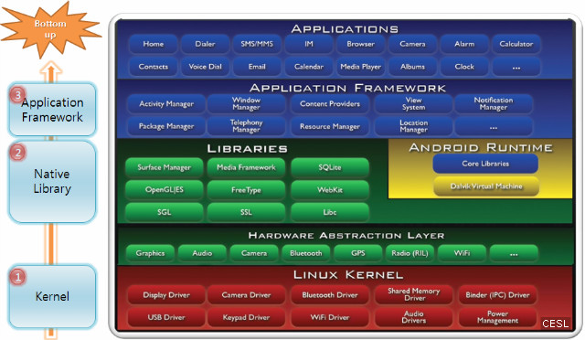

1. Java 가상머신 환경
2. 리눅스 Native 실행환경

Android Platform 구조
--------------------------------

기존 리눅스는 파일 시스템, 네트워크, 메모리 관리, 프로세스 관리, .. 기능을 지원한다.

차이점::

	1. 기존 리눅스와 다르게 Binder를 제공한다. Binder는 IPC도구이다. 
	2. 기존 공유메모리와 다른 ashmem 이 있다.
	3. Low Memory Killer가 다르다.
	4. Power Management가 다르다.
	5. GNU타입과 다르게 BIONIC타입 라이브러리를 제공한다.

Android Platform은 Library 계층과 Application Framework 계층을 합친 부분으로 구성되어 있다.

Library 계층
--------------------

1. System Service - Audio, Camera, Surface, Media
2. 외부 Library - Open GL/ES, Sqlite, Webkit
3. HAL - 시스템콜의 매커니즘과 달리 사용자는 HAL을 통해서만 커널안의 디바이스 드라이버를 사용할 수 있게 해주는 인터페이스이다. HAL GPL이 아니다. 즉 APL이다.

Android Runtime
---------------------

Dalvik Virtual Machine 위에서 동작한다. 

.. _system_service:

Application Framework & System Service
------------------------------------------

SystemService는 :ref:`MediaServer<mediaserver>` , :ref:`SurfaceFlinger<surfaceflinger>` , :ref:`SystemServer<systemserver>` 로 구성된다. 

System Service는 Binder를 사용하므로 다른 라이브러리하고 동작 방식이 다르다.
Android Framework 또한 시스템 서비스에 속하며 Binder를 사용한다.

Application Framework는 *SystemService* 라는 서비스로 동작한다. Application 프로세스와 별개로 동작한다. 부팅과 함께 실행되면서 Dalvik 위에서 실행된다. 이 부분은 Application이 동작하는것을 제어해준다.

*SystemService* 는 크게 2가지 분류로 자바로 구현된 :ref:`Core Platform Service<android_native>` 와 :ref:`HW Service<android_native>` 로 나뉜다. (Power Service, Package Service 등등)

Native Server는 C++로 구현되어 있고 Binder로 통신한다. 하드웨어 제어를 대신해준다고 보면된다. 하드웨어 제어는 2가지 방법이 있다. Function Library를 이용한 방식 또는 Native Server를 이용한 방식이 있다.

.. _android_native:

Function Library, Native Daemon, Native Server
------------------------------------------------------

.. image:: image/android_native.png

- 예를들어 블루투스를 제어할 경우 HW Service에 요청을 하고 *Function Library* 를 Load하고 하드웨어를 제어하는 형태이다. 라이브러리 형태로 존재
- Connectivity는 *Native Daemon* 에 접근한다. 소켓을 쓴다. 프로세스로 동작
- Camera, Audio, Surface는 *Native Server* 를 사용하고 Binder로 접근한다. 프로세스로 동작

임베디드 리눅스에서는 HAL을 사용하지 않고 리눅스가 플랫폼으로 사용될 경우에는 HAL을 사용한다. 각 통신사의 라이브러리가 끼워져서 프레임워크가 달라진다.

Android Framework And Binder
--------------------------------

.. image:: image/android_binder.png

- *Android Framework* 계층은 *Library* 계층과 밀접한 연관을 가지고있다.

Android 개발 환경
-----------------------

- Android SDK : Application 개발
- Android NDK : Library 개발
- Android PDK : Platform 개발

PDK
^^^^^^^

1. Make Utility, Python 환경이 필요
2. JDK 설치 필요
3. ..

빌드를 완료하게되면 5개의 파일이 생성된다.

- boot.img : 커널 이미지
- recovery.img
- system.img : /system 부분
- userdata.img : /usr 부분
- ramdisk.img : / 파일 시스템 부분

파일 시스템
------------------

/system
^^^^^^^^^^

루트권한이 있어야 접근이 가능한 공간

- app : 내장 어플리케이션이 저장되어있는 공간이다.
- framework : Application Framework (자바로 구현된 코드, .jar)
- lib : Library (C++로 구현, .so)

/data
^^^^^^^^^^

사용자 어플리케이션이 설치되고 데이터가 저장되는 공간

- app : \*.apk
- app-lib : \*.so
- data : 작업 디렉토리

/mnt
^^^^^^^^

외부 장치 연결시 필요한 공간

- sdcard 

기타
^^^^^^^^^

- /proc : 커널 동작시 필요한 여러가지 정보, 발생한 정보
- /dev : 디바이스 노드
- /sys : 디바이스 정보

위 3가지 디렉토리는 부팅할때 구성된다.

1. directory 생성
2. file system 결정

Android 부팅과정
----------------

리눅스 커널이 부팅하는것과 동일한 방식으로 부팅된다. `androidxref`_ 에서 소스코드를 확인할 수 있다.

.. image:: image/android_boot.png

1. 가장 먼저 *init* 프로세스가 실행된다.

..

	*생성 시점에 하는 일*

	(1) init.rc 내용 실행

	..

		* init.rc는 action과 service로 나눠져 있다.

		- action : 액션이 동작하는 시점에 해야하는 부분들이다. 환경설정
		- service : init는 서비스에 표시된 프로세스들을 생성한다.

		..

			*init.rc* 의 service에 명시되어 생성되는 프로세스

			* Daemon Process : 리눅스 서비스이며 주로 소켓통신 사용한다. ( 몇가지 안드로이드와 연관된 프로세스가 존재 ex)rild )

			.. _servicemanager:

			* ServiceManager : System Service를 관리해주고 바인더를 사용한다. *ContextManager* 로서 동작하고 같은 의미이다.

			.. _mediaserver:

			* *MediaServer* : System Service가 동작하는 프로세스이다.(Audio, Camera, MediaPlayer)

			.. _surfaceflinger:

			* *SurfaceFlinger* : System Service이다. (화면 출력 Surface) Binder를 사용한다.
			* Zygote : Application을 생성하는 프로세스이다.

			..

				.. _systemserver:

				(1) *SystemServer* : System Service가 동작하는 프로세스

					* *MediaServer* 와 *SurfaceFlinger* 는 Native System Service이고 *SystemServer* 같은 경우는 Java System Server이다. *SystemServer* 는 SDK를 통해 직접 접근할 수 있다. Application Framework 계층의 모듈은 모두 *SystemServer* 프로세스 안에서 실행된다.

					* 실질적으로 MediaServer, SurfaceFlinger, SystemServer는 Android를 위한 System Service로서 ServiceManager에 등록되어 동작하게 된다.

				(2) Application Process

				Dalvik이 각각 어플리케이션 마다 생성된다. 내용 구성물은 다음과 같다.

				+----------------------------+
				| Dalvik                     |
				+----------------------------+
				| 사용자 작성코드            |
				+----------------------------+
				| Resource                   |
				+----------------------------+
				| Core Lib (Android Library) |
				+----------------------------+
				| Native Lib                 |
				+----------------------------+

				이중에서 Resource와 Core Lib와 Dalvik은 공통이다. 공통적인 부분은 Zygote를 Fork하는 방식으로 생성한다. 복사한 후 사용자 작성코드만 끼워 넣는 방식으로 구현되었다.

	(2) device node 생성

	..

		* /dev 디렉토리에 디바이스 노드를 만든다.

	(3) system property 초기화

	..

		* Android가 공유하는 값이다. init 프로세스만 생성하고 초기화할 수 있다.

	(4) keychord 초기화
	(5) signal 등록

	..

		* 고아 Process 방지, 양부모 역할을 한다?

	(6) bootchart 생성

	..

		* 이 부분은 선택적인 부분이다.
		* 부팅과정에서 어떤 부분이 가장 시간을 많이 소비하는지 볼 수 있다.

	*생성 후 하는일*

	(1) device 연결 감시
	(2) property 변경/조회 요청 감시
	(3) keychord 발생 감시
	(4) process 종료 감

Android Application 실행
----------------------------

+--------+
| Zygote |
+--------+

*Zygote* 는 *SystemServer* 로 부터 생성요청을 받아 *App* 을 생성한다.

+-------+
| App	|
+-------+

*App* 과 *SystemServer* 는 Binder에 의해 관리/요청된다.

+---------------+
| SystemServer	|
+---------------+
| JNI		|
+---------------+

*SystemServer* 에서 필요한 라이브러리는 JNI를 이용해 사용한다. 예를들어 하드웨어 제어(GPS 정보)에 JNI가 사용된다.

안드로이드에서 IPC 종류는 다음과같다.::

	1. Binder 이용 (RPC로 불리운다.)
	2. Socket을 이용 (Data 공유)
	3. Linux IPC 도구이용 (Data 공유)

App -> Runtime Service -> lib
^^^^^^^^^^^^^^^^^^^^^^^^^^^^^^^^^^^^

:ref:`Function Library을 참조하자. <android_native>` 예를들어 GPS 정보를 활용할 경우에는 아래의 과정을 거쳐 가져온다. 

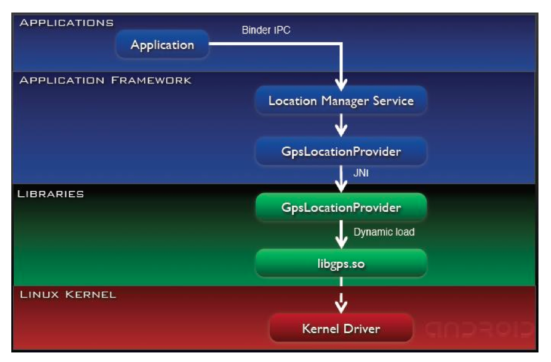

App -> Runtime Service -> Native Service -> lib
^^^^^^^^^^^^^^^^^^^^^^^^^^^^^^^^^^^^^^^^^^^^^^^^^^^^^^

:ref:`Native Server을 참조하자. <android_native>` 예를들어 MediaPlayer를 사용할 경우 SystemService에서 라이브러리를 로드하고 *MediaServer* 에 접근한다. MediaPlayer와 AudioFlinger 사이에서 Binder 통신이 이루어 진다.

+---------------+
| MediaServer	|
+---------------+
| MediaPlayer	|
+---------------+
| AudioFlinger	|
+---------------+

아래는 과정을 보여주고 있다.

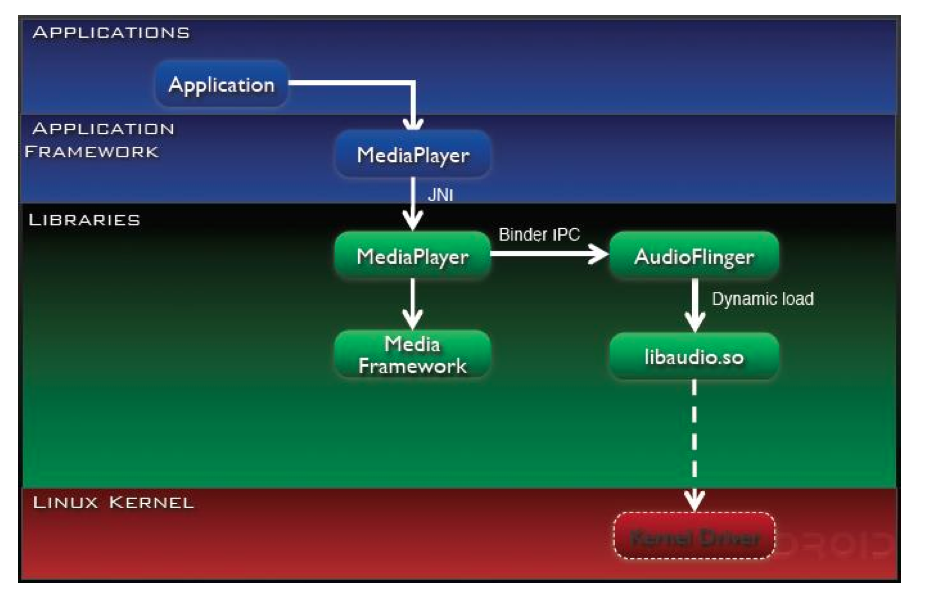

App -> Runtime Service -> Native Daemon -> lib
^^^^^^^^^^^^^^^^^^^^^^^^^^^^^^^^^^^^^^^^^^^^^^^^^^^^^^

:ref:`Native Daemon을 참조하자. <android_native>` 예를들어 전화를 사용하는 경우이다. 이때는 Socket을 사용한다.

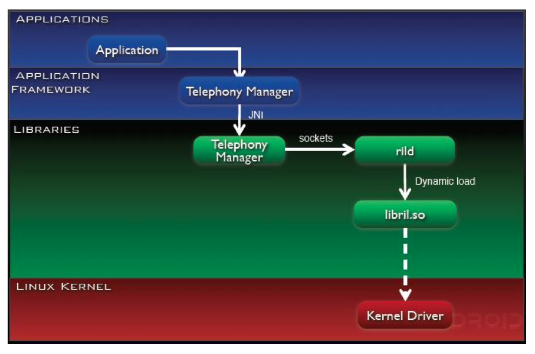

JNI
------

자바가 다른 언어로 만들어진 어플리케이션과 상호작용할 수 있는 인터페이스를 제공한다.

얻을 수 있는 장점:

1. 빠른 처리 속도
2. Hardware 제어
3. 기존 C/C++ 프로그램의 재사용

JNI 활용 방법

1. Java Code 에서 C/C++ 라이브러리 함수 호출하기
2. C/C++ 함수에서 Java 요소(Class/Field/Method) 사용하기

Android Application 구성
=================================

Service
----------

*Service* 컴포넌트는 Background 상태에서 동작하는 컴포넌트이다. 단순한 Background 형태로 주어진 일을 처리하기도 하고 Activity와 같은 Service Client에서 Service의 기능을 사용할 수 있게 하는 RPC(Service 제공 기능)형태로 동작한다. *Local Service* 와 *Remote Service* 로 나뉘어 진다. 

Service가 RPC 형태로 제공되는 예를 보자. 예를들어 계산기 프로그램에서 계산하는 부분을 Service로 구현할 수 있다. Activity 에서는 ``bindService()`` 메서드를 사용하여 Service와 연결할 수 있다. 그리고 계산 기능을 사용할 수 있다.

``manifest.xml`` 에서 아래와 같 수정해보면::

	<service
		android:name="...."
		android:process=":service" />

android:process를 추가하면 서비스와 액티비티가 별개의 프로세스로 분리되어 위 방식대로 Service의 함수를 호출하면 프로세스가 죽어버린다.

별개의 프로세스에서 함수 호출이 가능하도록 하려면 기존의 IPC방식으로는 불가능하다. 이때 커널의 Binder Driver를 통하여 다른 프로세스의 함수를 호출할 수 있다. Java 코드에서 이를 가능하게 하기위 AIDL을 사용한다.

IDL은 구현 언어가 다른 프로세스간의 통신을 위해 고안된 인터페이스 정의어이다. 안드로이드에서는 AIDL에 의해 컴파일되어 .java가 생성된다. 이를 정의함으로써 다른 프로세스에서 서비스를 사용할 수 있도록 한다.

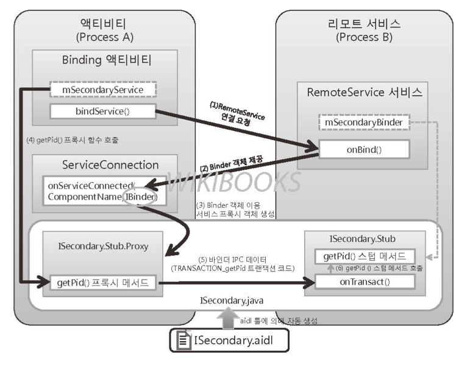

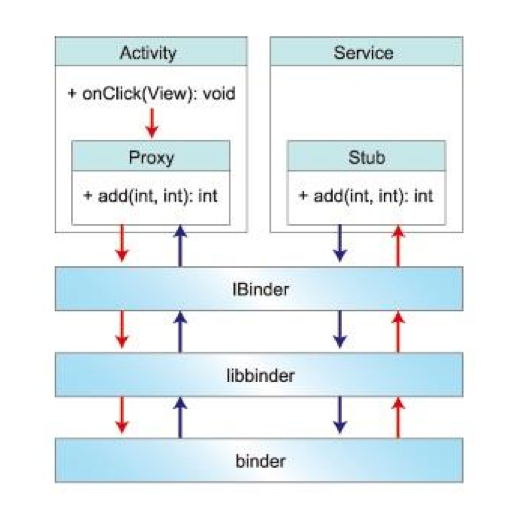

위 그림에서 proxy는 마샬링하는 역할 stub은 언마샬링하는 역할을 한다. 즉 *AIDL* 이 있을 경우 즉 프로세스가 분리되었을 경우 *Remote Service* 없을 경우 *Local Service* 이다.

이때 Remote Service와의 Binder 통신과 :ref:`System Service<system_service>` 에서 사용되는 Binder 통신이 같다.

Android Service는 크게 Application Service와 System Service로 나뉘어 진다. 

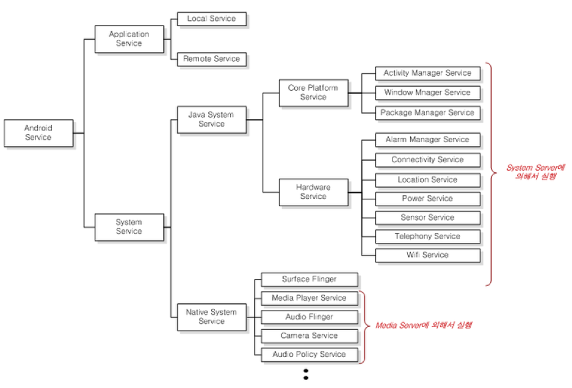

.. _system_service_again:

System Service Again
-----------------------

:ref:`System Service 설명<system_service>`

특징::

	1. 시스템 부팅과 함께 실행된다.
	2. Context Manager에 등록된다.
	3. Binder 통신을 한다.

System Services는 *Java* 로 구현되었는지 *C++* 로 구현되었는지 즉 2가지 타입으로 나뉘어 진다. 

Activity Service, Connectivity Service .. 등등 이 *Java System Service* 로서 Java 언어로 구현된 서비스이다. Application을 도와주는 역할을 하는 서비스이다. 이는 바로 :ref:`SystemServer<systemserver>` 이다.

*Native System Service* 같은 경우는 C++로 구현되었고 하드웨어를 제어하는 기능을 가진다. :ref:`SurfaceFlinger<surfaceflinger>` ,:ref:`MediaServer<mediaserver>` 가 있다.

기존의 IPC통신에서 사용되는 data는 형식이 정해져 있지 않다. 예를들어 원격 함수를 호출한다고 생각하면 함수마다 data형식이 다르기 때문에 송수신자 모두 통신 간 불편하다. 

Binder
=============

커널공간은 공유할 수 있기 때문에 Binder Driver를 포함시켜 IPC를 할 수 있게한다. *Binder IPC Data* 는 크게 핸들, RPC데이터, RPC코드, 바인더 프로토콜로 구성되어 있다. 

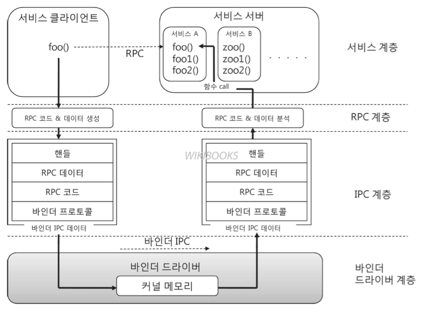

*핸들* 은 *Binder IPC Data* 를 수신하는 위치이다. 아마 진정한 의미는 핸들을 어디에 보낼지 뜻하는것 같은데 이 값은 :ref:`Context Manager<servicemanager>` 에 검색해서 핸들값을 결정할 수 있다. *RPC Code* ,*RPC Data*를 합친 Binder RPC는 서비스 요청정보이다. 어떤 정보를 전달할지에 대한 내용이 포함되어있다. 

*Binder Protocol* 은 Binder Driver가 데이터를 송신할지 수신할지 어떤 동작을 할지 
결정한다.

Binder Driver 동작
-----------------------

* Service 등록 : Context Manager와 Service Server간 IPC
* Service 검색 : Context Manager와 Service Client간 IPC
* Service 사용 : Service Server와 Service Client간 IPC

*Service 등록* 과정은 시스템 부팅 시점에 한번 이루어진다. 이 시점부터 Binder Driver와 통신상태를 유지하고 있어야 한다. Binder Node는 Binder Driver와 자신과 연결된 프로세스에 대한 데이터 블록이다. 모든 프로세스는 지속적으로 Binder Driver와 연결상태를 유지하며 연결상태를 체크한다.

Binder Driver은 노드를 Binder Node Table에 관리한다. 첫번째 노드는 항상 Context Manager이다. 이때 Binder Node 테이블에서 각 노드의 식별자는 핸들값이 된다.

Service Framework 동작
-----------------------

개발자의 입장에서 Java System Service를 개발하고자 한다면 Java System Framework를 사용하고 
Native System Service를 개발하고자 한다면 Native System Framework를 사용하면된다.

* Service Proxy : Service 요청 작성 (RPC Code/ Data)
* Service Stub : Service 요청 해석 / Service 실행 

인터페이스를 아래와 같은 계층으로 나누어 볼 수 있다.

* Service Layer : IInterface, BnInterface, BpInterface, BpRefBase
* RPC Layer : Service Proxy, Service Stub
* IPC Layer : BBinder, BpBinder, IPCThreadState, ProcessState, Parcel

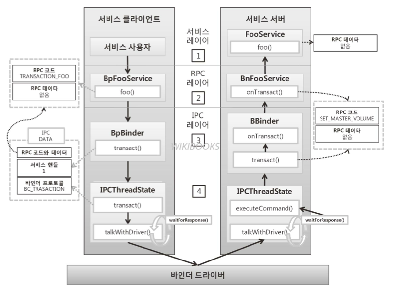

BpBinder는 Context Manager에 핸들값을 요청한다. 

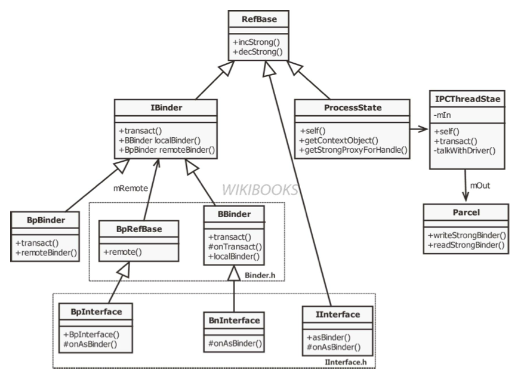

약어::

	B : Binder
	Bn : Binder native
	Bp : Binder Proxy

	"B" 나 "Bn" 이 접두사로 붙을경우 서버쪽에서 동작하는 클래스 "Bp"가 붙으면 클라이언트 측에서 동작하는 클래스이다.

* IBinder : IBinder 타입은 바인더 IPC데이터의 타입이다. 또한 바인더 드라이버 내부에서 사용하는 데이터 타입이다.
* IInterface : 서비스를 정의하는 인터페이스이다. 이를 상속받아 서비스 인터페이스(ServiceInterface)를 정의한다.
* ServiceInterface를 : 위 그림 외에 IInterface를 상속 받아 정의된 인터페이스이다.
* BnInterface : 위 그림 외에도 ServiceInterface를 상속 받고 있다.
* BpInterface : 위 그림 외에도 ServiceInterface를 상속 받고 있다.

다음표에는 BnInterface를 부모로 갖는 클래스들이 있다.

+---------------+
|BnInterface	|
+---------------+
|Service Stub 	|
+---------------+
|Service 	|
+---------------+

다음표에는 BpInterface를 부모로 갖는 클래스들이 있다.

+---------------+
|BpInterface 	|
+---------------+
|Service Proxy  |
+---------------+

네이티브 서비스 추가 실습
^^^^^^^^^^^^^^^^^^^^^^^^^^

:download:`실습자료.zip<sample/Archive.zip>` 

각 디렉토리에 있는 소스를 android/frameworks에 복사한다. 그리고 ``android/build/target/product`` 에 ``base.mk`` 에 모듈을 등록해야한다.::

	helloworldservice \
	helloworldclient \
	libhelloworld \

	위와 같은 내용을 PRODUCT_PAKAGES += \ 아래에 추가한다.

안드로이드 빌드 방법은 다음과같다. android 소스 홈에서 다음과 같이 진행한다.

1. SOURCE BUILD/ENVSETUP.SH 입력
2. launch 입력
3. 1을 입력한다.
4. make 입력

컴파일된 결과는 ``out/target/product/generic`` 에 생성된다. ``~/usr/sdk/tools/emulator -system system.img -data userdata.img -ramdisk ramdisk.img`` 라는 명령어로 빌드된 결과를 에뮬레이터로 실행할 수 있다.

부팅이 되었다면 adb shell을 입력하고 ls ``/system/bin/hello*`` 와 ``ls /system/ib/libhello*`` 을 입력해보면 파일이 추가된것을 확인할 수 있다.

그리고 ``/system/bin/helloworldservice &`` 을 입력하면 프로세스를 하나 생성할 수 있다. ``service list`` 라는 명령어를 입력하면 0번에 Context Manager에 등록된것을 볼 수 있다. ``/system/bin/helloworldclient`` 를 입력하면 네이티브 서비스가 동작하는것을 확인할 수 있다.

부팅시에 자동으로 SystemService로 등록하길 원한다면 ``android/system/core/rootdir`` 에 ``init.rc`` 에 아래와 같은 내용을 추가해한다.::

	service media ... 밑에 아래 추가하자.

	service hello /system/bin/helloworldservice
	class main

다시 컴파일 후 에뮬레이터로 실행하고 ``ps | grep hello`` 를 입력해보면 init를 부모로 갖는 서비스가 실행된것을 확인할 수 있다. ``logcat -d | grep hello`` 를 입력해보면 서비스가 실행될때 발생한 로그도 확인할 수 있다.

``service list | grep android.apps`` 를 입력해보면 역시 서비스가 보인다.

android.mk에서 ``LOCAL_PATH:= $(call my-dir)`` 은 현재디렉토리를 시작 경로로 하겠다는 의미이다. 따라서 다른 경로에 소스코드를 위치시켜도 상관없다.

framework.native.include 분석
^^^^^^^^^^^^^^^^^^^^^^^^^^^^^^^^^^^

IHelloWorldService.h 분석::
	
	#ifndef IHello_World_Service_H
	#define IHello_World_Service_H

	#include <binder/IInterface.h>

	namespace android {

	  //HelloWorldService에서 사용할 RPC 코드 정의
	  enum {
	    HW_HELLOWORLD = IBinder::FIRST_CALL_TRANSACTION,
	    TRANSACTION_add,
	    TRANSACTION_subtract,
	    TRANSACTION_multiple,
	    TRANSACTION_divide
	  };

	  //서비스 인터페이스인 IHelloWorldService 클래스를 정의한다.
	  class IHelloWorldService: public IInterface 
	  {
	    public:
	      //서비스 인터페이스 매크로
	      DECLARE_META_INTERFACE(HelloWorldService);
	      // 서비스 함수
	      virtual status_t helloWorld(const char *str)=0;
	      virtual int add(int numberOne, int numberTwo)=0;
	      virtual int subtract(int numberOne, int numberTwo)=0;
	      virtual int multiple(int numberOne, int numberTwo)=0;
	      virtual int divide(int numberOne, int numberTwo)=0;
	  };
	  
	}; // namespace android

	#endif

서비스 구현 시 형변환

1. 사용자 Service type -> IBinder (클라이언트 쪽, 클리이언트가 드라이버에 요청할 때) -> asBinder()가 호출됨
2. IBinder -> 사용자 Service type (드라이버에서 사용자에게 전달할 때) -> asInterface()가 호출됨

이때 ``DECLARE_META_INTERFACE`` 매크로를 이용하여 형변환을 수행한다. 매크로 내부에서 onAsBinder()라는 가상함수에서 asBinder()를 호출할지 asInterface()를 호출할지 결정한다.

HelloWorldService.h는 BinderService.h를 상속하여 서비스 초기화 메서드를 가지게된다. BpHelloWorldService.h에는 service proxy 함수가 위치한다. BnHelloWorldService.h에는 onTransact가 위치하고 이것은 service stub이다.

framework.native.libs 분석
^^^^^^^^^^^^^^^^^^^^^^^^^^^^^^^^^^^

IHelloWorldService.cpp 에서 DECLARE_META_INTERFACE는 정의에 대응되는 IMPLEMENT_META_INTERFACE 라는 매크로가 위치한다.  HelloWorldService.cpp 에는 서비스 함수 구현이 있다. 

BpHelloWorldService.cpp 에는 서비스 Proxy가 위치한다. 바인더에 RPC 데이터를 담을때는 Parcel에 데이터를 담는다. 여기서 data 변수는 RPC데이터이고 reply 변수는 응답결과를 담는 변수이다. 

*BpBinder* 입장에서 서비스를 검색할때 검색할 대상을 알아야한다. 서비스를 등록할때 검색 키(서비스의 식별자)를 RPC 데이터의 첫번째 인자로 넘겨줘야한다.

다음과 같은 코드에서 확인할 수 있다.::

	data.writeInterfaceToken(IHelloWorldService::getInterfaceDescriptor());
    data.writeInt32(numberOne);
    data.writeInt32(numberTwo);
    status_t status = remote()->transact(TRANSACTION_add, data, &reply);

BpBinder에서 transact 함수로 ContextManager에게 키값을 요청한다.::

	status_t status = remote()->transact(TRANSACTION_add, data, &reply);

BnHelloWorldService는 RPC코드를 분석해서 정상적인 요청인지 분석해서 요청한 함수를 호출해준다.

인자 전달이 올바른지 체크해준다.::

	CHECK_INTERFACE(IHelloWorldService, data, reply);

서비스 함수 호출 부분.::

	int arg1 = data.readInt32();
    int arg2 = data.readInt32();
              
    reply->writeInt32( add(arg1, arg2) );

     

framework.native.helloworld 분석
^^^^^^^^^^^^^^^^^^^^^^^^^^^^^^^^^^^

main_helloworldservice.cpp는 서버를 등록해주는 역할을 한다. instantiate를 호출하면 ContextManager에 서비스가 등록되고 ProcessState의 self에서 startThreadPool()를 호출해서 서버가 바인더드라이버와 연결을 유지하게 한다. joinThreadPool()를 호출해서 프로세스를 실행상태로 나둔다.::

	int main(int argc, char *argv[])
	{
	   HelloWorldService::instantiate();
	   ProcessState::self()->startThreadPool();
	   ALOGI("HelloWorldService is starting now");
	   IPCThreadState::self()->joinThreadPool();
	   return 0;
	}

main_helloworldclient.cpp를 보자.

* getService : ContextManager에 검색 요청하는 함수
* addService ContextManager에 등록 요청하는 함수

여기서 서비스를 찾기위해 IHelloWorldService 타입을 알고 있어야한다. 이는 JAVA JNI에선 알기 어렵다.

   	sp<IHelloWorldService> sHelloWorldService;

바인더 드라이버로 부터 반환 받은 결과를 사용할 수 있게 형변환한다.::

	sHelloWorldService = interface_cast<IHelloWorldService>(b);

어플리케이션을 사용하고 싶을때
^^^^^^^^^^^^^^^^^^^^^^^^^^^^^^

Application에서 BpHelloWorldService를 JNI로 바로 사용하기 어렵고 Native Proxy가 존재해야한다.

Java System Service 구현 시 차이점

* AIDL을 사용할 수 있다.

java-hello-calculator ?
^^^^^^^^^^^^^^^^^^^^^^^^^^^^^^^^^^^

Java로 구현된 System Service 로서 System Server에서 동작하는 매니저이다.

``android/frameworks/base/core/java/android/app`` 디렉토리에 3개의 파일을 넣을 수 있다.

사용할 수 있도록 세팅을 해보자. ``android/frameworks/base/core/java/android/content`` 디렉토리로 이동하여 Context.java를 열어보자. 그리고 public static final String ALARM_SERVICE = "alarm"; 밑에 Alarm 부분의 주석과 코드 1줄을 복사하여 AlarmManager대신에 HelloWorldManager로 바꾸면 된다. alarm 대신 hello로 바꾼다.

``android/frameworks/base/services/java/com/android/server`` 에 ``SystemServer.java`` 라는 파일을 찾아보자. 이 프로세스가 Zygote가 시스템 부팅시 실행하는 프로그램이다. 

``SystemServer.java`` 에 import android.app.HelloWorldService; 를 추가하고 345라인 밑에 아래 코드를 추가하자.::

	try{
		Slog.i(TAG,"HelloWorld Service");
		HelloWorldService helloWorldService = new HelloWorldService(context);
		ServiceManager.addService(Context.HELLO_SERVICE, helloWorldService);
	}catch(Throwable e){
		Slog.e(TAG, "Failure starting HelloWorld Service",e);
	}

서비스 래퍼를 만들기 위해 ``android/frameworks/base/core/java/android/app`` ContextImpl.java 파일을 찾는다. ALARM을 검색해보자. 그리고 registerService(...) 부분을 아래 라인에 복사하고 아래와 같이 수정하자.::

	registerService(HELLO_SERVICE, new ServiceFetcher(){
		public Object createService(contextImple ctx){
			IBinder b = ServiceManager.getService(HELLO_SERVICE);
			IHelloWorld service = IHelloWorld.Stub.asInterface(b);
			return new HelloWorldManager(service);
		}
	});

마지막으로 수정해야할 부분은 다음이다. ``android/frameworks/base/Android.mk`` 을 열여보자. ``aidl_files :=`` 라는 부분을 찾아보자. 그리고 가장 앞줄에 아래 부분을 등록하자.::

	frameworks/base/core/java/android/app/IHelloWorld.aidl \

make를 해보자. 만약 에러가 날경우 make update-api 를 입력하고 다시 make를 해보자.

시스템을 부팅해보면 service list 에서 helloworld 

HelloWorldManager.java
^^^^^^^^^^^^^^^^^^^^^^^^^^^^^^^^^^^

다시 android.app에 복사한 자바 코드를 보자. IHelloWorld를 멤버로 가지고 있는것을 볼 수 있다. 서비스를 얻어내기 위해 getSystemService() 메서드를 사용할 수 있다. 이 메서드는 Java System Service 래퍼에 접근할 수 있는 함수이다.

android-4.4.2-sdk_eng_linux-x86.zip 파일은 Context에 방금 만든 서비스를 추가한 새로운 SDK이다. 

Java System Service
^^^^^^^^^^^^^^^^^^^^^^^^^

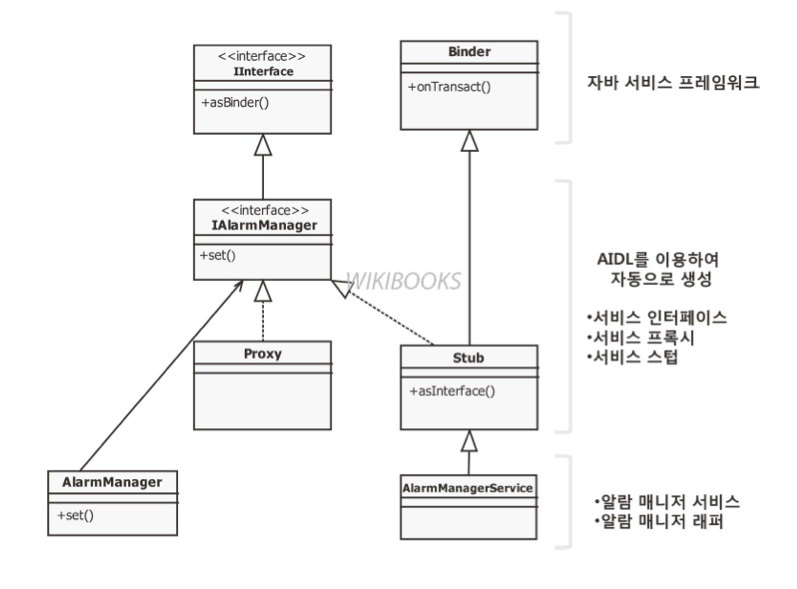

