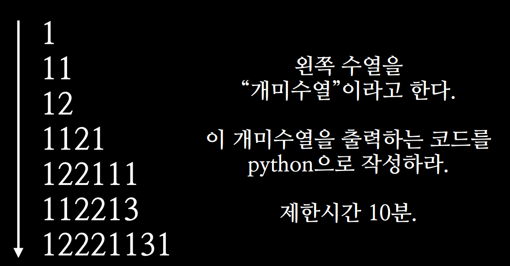

.. _algorithm_question:
.. highlightlang:: c++

===================
알고리즘 문제 모음
===================

`알고리즘 풀이 소스코드 저장소 <https://github.com/qwefgh90/AlgorithmSolution>`_

-------------
개미수열
-------------

개미 수열, 읽고 말하기 수열이라고 불린다. 해답은 이전항을 읽고 말하면 다음항이 된다. 1시간 동안 고민했으나 너무어려워서 4개 이상의 억지 규칙을 찾을 수 있었다... 하지만 답은 아닌듯. (A개의 B라고 읽으면 해결할 수 있다.) 

읽고 말하기 수열은 다음과 같이 시작하는 수열이다. 대한민국에서는 소설 개미에서 소개되면서 유명해졌기 때문에, 개미 수열이란 이름으로 잘 알려져 있다. `개미수열 <http://ko.wikipedia.org/wiki/%EC%9D%BD%EA%B3%A0_%EB%A7%90%ED%95%98%EA%B8%B0_%EC%88%98%EC%97%B4>`_

.. raw:: html

   

   

   

-------------
COINS
-------------

알고스팟의 COINS라는 문제이다. `COINS <https://www.algospot.com/judge/problem/read/COINS>`_ 예를들어 우리나라 화폐가 5원, 15원, 20원 이있다면 40원이란 돈을 표현하는 가지의 수를 구하라와 같은 문제이다. 

가장 처음 접했을때는 당연하게도.. 40원을 가장 큰 단위의 돈으로 표현하고 예를들면 40=20+20, 20=5*4 , 20=15+5, 15=5*3와 같이 변형과정을 쭉 나타내 보았다. 하지만 경우의 수를 구하는 방법을 정확하게 나타낼 수 없었다. 중복도 발생하고 동전이 서로 배수관계도 아니기 떄문에 모든 경우의 수를 찾기 어려웠다. 결론은 스스로 풀지 못했다. 알고리즘 잘하는 형에게 도움을 청해 방법을 들었는데... 결론은 DP로 풀 수 있는 문제였다.

모든 경우의 수를 표로 나타내면서 재귀식과 해를 구할 수 있는 동적 계획법을 사용하면 쉽게 풀 수 있는데 아래 표를 보자.

+------------------+-----+---+----+----+----+----+----+----+----+
| 잔돈 종류  / 금액| 0   | 5 | 10 | 15 | 20 | 25 | 30 | 35 | 40 |
+==================+=====+===+====+====+====+====+====+====+====+
| 5                | 1   | 1 | 1  | 1  | 1  | 1  | 1  | 1  | 1  |
+------------------+-----+---+----+----+----+----+----+----+----+
| 15               | 1   | 1 | 1  | 2  | 2  | 2  | 3  | 3  | 3  |
+------------------+-----+---+----+----+----+----+----+----+----+
| 20               | 1   | 1 | 1  | 2  | 3  | 3  | 4  | 5  | 6  |
+------------------+-----+---+----+----+----+----+----+----+----+

첫번째 행은 잔돈의 종류가 5원만 있을때의 경우의 수를 나타내었다. 5원일 때는 모든 금액을 1가지로 밖에 표현할 수 없다. 0원에 채워 넣은 이유는 실제로 점화식에서 편하게 계산하기 위해서 이다. 잔돈이 15원 (0원, 15원) 일 때 부터 중요하다. 금액이 10이하 일 때는 15원을 사용할 수 없다.

금액이 15원일 경우 5원으로 표현할 수 있는 가지수 + 금액 0원을 표현하는 가지수(15원은 15 + 0이라 그렇다.)이다.(2개 -> 5-3개, 15-1개) 금액이 30원일 경우 5원으로 표현할 수 있는 가지수 + 금액 15원을 표현하는 가지수(30원은 15 + 15이라서 그렇다.)이다. (3개 -> 5-6개, 5-3개 15-1개, 15-1개 15-1개)

핵심은 (15-1개 + 5-3개, 5-3개 + 15-1개)와 같이 다른 표현인것 같지만 교환법칙이 성립하기 떄문에 같은 경우로 보는 성질이 있다는 것이다. 점화식은 f(현재 잔돈, 금액) = f(현재 잔돈, 금액 - 잔돈의 크기) + f(이전 잔돈, 금액) 와 같다.

.. raw:: html

   

   

   

-----------------------------------------
Shortest Palindrome을 만들어라
-----------------------------------------

.. index:: 이진 탐색

------------------------------------------------------
이진 탐색(BST) 응용
------------------------------------------------------

정렬된 배열에서 O(logN)의 시간안에 값을 찾는 방법에는 이진 탐색이 있다. (O는 최악의 경우를 나타내는 시간 복잡도 표기법)

최근에 `GCJ의 Deceitful War <https://code.google.com/codejam/contest/dashboard?c=2974486#s=a&a=3>`_ 을 풀면서 이진 탐색을 응용해본 경험이 있다. 즉 이진 탐색처럼 아예 같은 값을 찾거나 없을경우 큰 값중 가장 작은 값을 찾는 알고리즘이다.

기본적으로 이진 탐색을 구현한 후 같은 값이 없는 케이스에서 예외처리를 해주면 구할 수 있다.

1) 알고리즘 내에서 start가 end보다 크게되는 경우는 start를 반환하면됨
2) 알고리즘 내에서 start와 end가 같은 경우는 start index안의 값이 작으면 start+1반환 크면 start반환 

반대로 같거나 작은 값은 1) 2)에서 조건을 조금만 수정하면 될듯하다.

실제 코드는 다음과 같다.::

  //이분 탐색
  //같거나 큰값
  int find(int start, int end, double target){
    if (target < minPeek()) //인덱스 0 반환
      return 0;
    if (target > maxPeek()) //존재하지 않음
      return -1;

    int sindex = start + (end - start + 1) / 2; //+1을 안해주어도 된다.

    //큰값 중 가장 작은값
    //예 1 2 4 중에서 start와 end 둘다 2인 경우 또는 4인 경우 나눠서 처리해야함
    if (start == end){
      if (target > data[start]){
        return start + 1;
      }
      else{
        return start;
      }
    }

    //큰값 중 가장 작은값
    //예) 1 2 4  에서 end가 2 start가 4를 가르치는 경우 start를 반환해야 한다.
    if (end < start){
      return start;
    }

    //같은값
    if (target == data[sindex]){
      return sindex;
    }

    else if (target > data[sindex]){

      //같으면 큰값중 가장 작은값
      /*if (sindex + 1 == end)
        return start;*/
      return find(sindex + 1, end, target);

    }
    else if (target < data[sindex]){

      //같으면 큰값중 가장 작은값
      /*if (start == sindex - 1)
        return start+1;*/
      return find(start, sindex-1, target);
    }
  }

.. raw:: html

   

   

   

