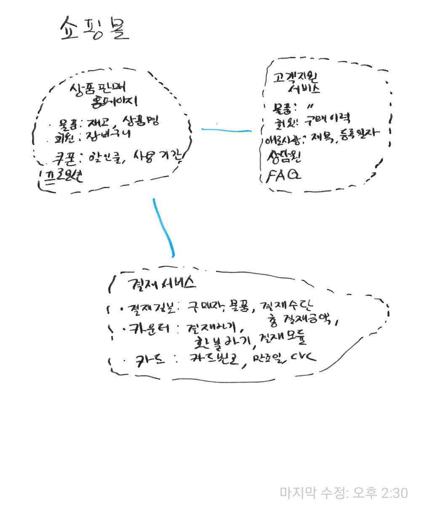

.. _design_ddd:

====================================================
Domain Driven Design(DDD)
====================================================

-------------------------
개념
-------------------------

도메인 주도 설계란 프로그램으로 돕거나 해결하고자 하는 **분야(Domain)를 중심으로 전체 시스템이나 서브 시스템을 모델링하는 방법론이다.**
도메인은 여러개의 서브 도메인으로 나눠질 수 있으며 도메인 모델로 표현된다. 도메인 모델은 관계자들이 이해할 수 있는 유비쿼터스 언어로 작성되며 분석, 설계, 개발 전 과정에서 활용될 수 있다.

*개인적으로는 분야를 관심으로 해석해도 맞아 떨어지지 않나 싶다.*

**장점** ::

  도메인 주도 설계는 특히 시스템에서 적당한 크기의 도메인을 추출하고 나누고 그 관계를 정의하고, 표현할 수 있도록 도와준다.
  여기서 적당한 크기란 유지보수하기 쉬우며, 팀이나 개인이 책임질 수 있는 정도의 크기이다.

도메인 주도 설계에서 **여러가지 시스템(내부 또는 외부)이나 분야는 도메인 모델로 표현된다.** 도메인 모델은 핵심 개념으로 모든 관계자가 이해할 수 있는 유비쿼터스 언어로 작성되는게 포인트이다.
이는 회의를 통해 설계되는 공통의 언어로 단순하게는 도메인에 관련된 용어의 집합을 의미한다. 

**도메인의 중요성** ::

  프로그램이 다뤄야하는 영역의 지식은 실제 프로젝트의 성공에 상당한 영향을 끼칠 수 있다.
  당연하게도, 개발자가 어떤 분야(도메인)에 대해 잘 모르는 상태에서 설계 및 개발하면 결과물의 품질이 떨어지게 된다.
  업무 분석가가 먼저 모든 내용을 정리해서 개발자에게 전달하더라도, 이는 개발 분야와 동떨어진 결과물이기 때문에 설계자나 개발자는 다른 관점에서 다시 재해석하여 애플리케이션을 설계 및 개발하게 된다.

도메인 주도 설계는 특히 큰 규모의 시스템을 구축할때 효과적이다. 규모가 크다는 것은 여러 팀이 시스템을 나눠서 설계, 개발, 유지보수를 해야할 수 밖에 없고 이때 도메인 모델이 매우 유용하기 때문이다.
작은 도메인 모델은 서브 도메인 모델이라 불리기도 한다.

--------------------------------------------------
도메인 모델
--------------------------------------------------

도메인 모델은 도메인을 그림이나 글로 표현한 것이다. 이는 다소 추상적으로 표현될 것이다.
일반적으로 도메인 모델은 바로 코드와 연결될 수 있으며, 코드와 상호 피드백을 하면서 모습이 변경될 수 있다.
도메인 모델은 비지니스의 핵심을 담아야 하며 계속 통합되어야 한다.

여러개의 도메인 모델 표현하고 하나의 시스템으로 동작하게 하기위해 전략적 설계(strategic design)를 활용한다.

전략 설계를 위한 요소는 다음과 같다.

* Bounded Context(분할된 컨텍스트)
* Context Map(컨텍스트 맵)
* 유비쿼터스 언어
* 지속적인 통합

도메인 모델 설계를 위한 블록은 다음과 같다. 이러한 패턴을 이용해 설계하는 것을 전술적 설계(tactical design)이라 불리기도 한다.

* 계층형 아키텍처(Layered Architecture)
* 엔터티(Entity)
* 값 객체(Value Object)
* 서비스(Service)
* 저장소(Repository)
* 팩토리(Factory)
* 집합(Aggregate)

--------------------------------------------------
Bounded Context(분할된 컨텍스트)
--------------------------------------------------

기본적으로 서브 도메인 모델은 각기 다른 분야의 문제를 다루기 때문에 구분되는 존재이다. 하지만 **통합되는 과정에서** 각 모델은 구분할 수 없는 모습으로 강하게 결합된다.
점점 큰 시스템안의 **각 모델간의 경계를 명확히 표시할** 필요가 있었고, 각 모델이 통합될 때 어떤 형태로 통합되는지 표현될 필요가 있게 되었다.

그래서, 각 모델을 명확하게 구분하기 위해 가상의 경계선을 둘러 명확하게 분리하고 이에 **분할된 컨텍스트라** 이름을 지었다. 분할된 컨텍스트의 특징은 특정한 문맥에 따라 도메인의 요소를 해석한다는 것이다.

분할된 컨텍스트는 시스템의 무결성 유지를 위해 개발의 변경에 다른 피드백을 수용해야한다. 따라서 테스트 케이스틀 통해 변경사항이 모델에 순응(Conform)하는지 지속적으로 확인해야한다. 이를 지속적인 통합이라 부른다.

쇼핑몰 예시에서와 같이 **같은 회원이라도** 고객지원 서비스와 상품판매 홈페이지에서 다르게 해석된다는 것이다.

--------------------------------------------------
Context Map(컨텍스트 맵)
--------------------------------------------------

분할된 컨텍스트에는 스스로 동작할 수 컨텍스트도 있지만 다른 컨테스트를 참조해야하는 경우도 있다. **분할된 컨텍스트 간의 관계를 표현하기 위해 컨텍스트 맵이 활용된다.**

컨텍스트 같은 관계를 표현하는 방식에는 다음이 있다.

* 공유 커널
* 공급자-소비자
* 순응
* 변질 방지 레이어(Anti-corruption)
* 분할 방식
* 오픈 호스트 서비스
* 증류

^^^^^^^^^^^^^^^^^^^
공유 커널
^^^^^^^^^^^^^^^^^^^

일반적으로 지나치게 크기가 큰 컨텍스트는 지속적으로 도메인 모델을 유지하기가 어려울 수 있다. 하나의 팀에서 맡기에는 규모가 너무 크거나, 팀의 지속적 통합 스킬이 부족할 경우 지속적 통합의 비용은 너무나 높아진다.
그래서 큰 컨텍스트를 여러개의 컨텍스트로 분할하고 팀을 배치해서 관리하게 된다. 하지만 팀을 나눴기 때문에 공통으로 사용하는 모델에 대한 변경이 자유롭게 일어나게 되고, 서로 하나의 모델을 두고 경쟁하게 된다.

**공유커널은 양쪽 컨텍스트에서 명확하게 공유되는 부분(컨텍스트의 일부분, 교집합)을 정의하고 양쪽 팀이 공동으로 수정에 대한 책임 및 테스트에 대한 책임을 지도록 하는 패턴이다.**
공유커널은 유지비용이 크므로 작게 유지되어야 한다. **도메인 모델의 소스코드나 데이터베이스의 일부분이** 공유 커널로 활용될 수 있다.

^^^^^^^^^^^^^^^^^^^^^^
공급자-소비자
^^^^^^^^^^^^^^^^^^^^^^

컨텍스트 간에는 의존 관계가 존재할 수도 있다. **기본적으로 특정한 정책에 묶여 있지 않을때 이러한 관계를 upstream-downstream 관계라** 칭하기도 한다.
upstream팀은 downstream팀에 상태에 관계 없이 컨텍스트를 변경할 수도 있으며 성공할 수도 있다.
downstream팀의 경우 upstream팀의 우선순위에 따라 자신의 요구는 뒤로 미뤄지기도 한다. 또는 upstream팀의 변경 승인 절차가 너무 복잡하여 downstream팀은 오랫동안 정체될 수도 있다.
upstream팀의 경우 upstream팀이 downstream팀의 컨텍스트가 무너지는 것을 지나치게 걱정을 하여 어떠한 변경을 하지 못할 수도 있다. 또는 downstream팀의 거부할 수 있는 권한이 너무 강력하여 변경을 포기할 수도 있다.

**이러한 경우 컨텍스트간에 명확하게 공급자-소비자 관계를 갖고 공급자는 소비자와 적극적으로 협상하고, 예산을 투입하여 소비자가 걱정없이 계획을 세울 수 있도록 해야한다.**
클라이언트 팀은 자신의 도메인 모델을 유지하기 위해 변질 방지 레이어를 설치 할 수 있다.

^^^^^^^^^^^^^^^^^^^^^^
순응
^^^^^^^^^^^^^^^^^^^^^^

upstream팀이 downstream팀의 요청을 들어줄 필요가 없는 경우도 있다. 어떤 경우에는 upstream팀에 있는 선한 사람이 요청을 들어주기로 약속을 하기도 한다.
하지만 어떤 이득이나 당위성이 없어서 결국 upstream팀은 downstream팀의 요구를 묵살하고, 이를 믿고 세웠던 downstream팀의 모든 계획은 물거품으로 돌아갈 수 있다.
이 경우에는 upstream팀이 언젠가는 지원해준다는 생각을 버리고, 현재 주어진 기능에 순응하는게 나을 수 있다.

**번역 계층이 버리고 downstream팀 고유의 이상적인 모델을 포기해야 할지라도, upstream의 모델을 완전히 받아들이는게 문제를 간단하게 풀 수 있다.**

^^^^^^^^^^^^^^^^^^^^^^^^^
변질 방지 레이어
^^^^^^^^^^^^^^^^^^^^^^^^^

어떤 경우 upstream 컨텍스트가 너무 크고 영향력이 강해서 downstream 컨텍스트가 자신의 모델을 버리고 upstream 모델을 닮아 갈 수 밖에 없는 경우가 있다.
upstream 컨텍스트가 레거시이고 고도화 프로젝트에 적합하지 않은 모델을 가지고 있다면 upstream 모델을 따르는건 너무 위험할 수 있다.

하지만 여전히 컨텍스트 간 통합은 중요하므로, 변질 방지 계층을 활용해 이러한 통합의 문제를 해결할 수 있다.
**변질 방지 계층은 한쪽 모델을 다른 모델에서 사용할 수 있도록 번역하고 인터페이스를 제공하여, 양쪽 컨텍스트에 어떠한 수정도 없이 컨텍스트를 통합하게 도와준다.**

^^^^^^^^^^^^^^^^^^^^^^^^^^^
분할 방식
^^^^^^^^^^^^^^^^^^^^^^^^^^^

컨텍스트간의 기능 공유는 항상 큰 유지 비용을 발생하므로, 어떠한 경우에는 냉철하게 접점을 없애고 분할하는 것을 고려해야한다.

^^^^^^^^^^^^^^^^^^^^^^^^^^^
오픈 호스트 서비스
^^^^^^^^^^^^^^^^^^^^^^^^^^^

여러개의 공급자-소비자 관계는 전체 비용을 많이 증가시키도 한다. 따라서 upstream팀에서 자체적으로 개발한 프로토콜을 클라이언트에 제공하여 비용을 낮추기도 한다.
경우에 따라 특정 클라이언트를 위한 예외 프로토콜을 제공할 수도 있다.

-------------------------
참조
-------------------------

- 도메인 주도 설계란 무엇인가? (쉽고 간략하게 이해하는 DDD)
- https://dddcommunity.org/
- http://domainlanguage.com/ddd/reference/
- https://www.youtube.com/watch?v=NNFJREcalc0&t=104s