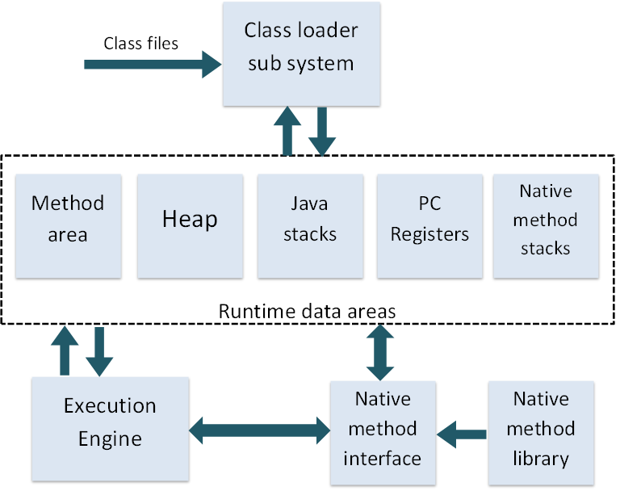

.. _java_jvm:

****************************
JVM
****************************

**JVM은 어떤 환경에서든 자바 프로그램을 동작시킬 수 있도록 플랫폼 독립적으로 구현된 가상머신이다.** JVM은 `The Java Virtual Machine Specification <https://docs.oracle.com/javase/specs/jvms/se7/html/>`_ 을 준수하며 JVM 스펙을 기반으로 누구나 JVM를 개발할 수 있다. **자바 프로그램** 은 중간언어인 Java bytecode 로 구성되어 있다. 일반적으로 JDK에 포함된 JVM은 HotSpot VM이라고 불린다.

============================
Open JDK 라이센스
============================

Sun은 Java를 대중에 알리고 오픈소스의 힘을 얻기위해 Open JDK라는 이름으로 소스코드를 공개하였다. 이때 적용된 라이센스는 GPLv2 이었다. 하지만 GPL의 특성상 Class를 사용한 소프트웨어를 모두 공개해야 하므로 개발자들이 꺼릴 수 밖에 없었다. 따라서 classpath 라는 예외 조항을 두었다고 한다. 

하지만 Java ME에는 이 조항이 적용되지 않았고 라이센스로 Sun은 이득을 챙겼다고 한다.

**구글은 Dalvik VM이라는 기존의 JVM스펙을 따르지 않는 가상머신과 전혀 다른 Bytecode를 사용하였다. Java의 개발환경을 사용하였지만 결과적으로 독자적인 툴을 이용해 Dalvik 바이트코드를 사용한 것이다. Dalvik은 레지스터 기반 명령어 머신이다.**

============================
Java bytecode
============================

자바의 중간언어가 Java bytecode라 불리는 이유는 OpCode가 1바이트를 차지하기 때문이다. 최대 256가지의 명령을 가지고 있다. Java bytescode를 분석하는 툴로 javap 라는 프로그램이 있다.

============================
JVM 구조
============================

`JVM 스펙 <https://docs.oracle.com/javase/specs/jvms/se7/html/jvms-2.html#jvms-2.5.5>`_ 을 확인할 것을 추천한다.

클래스 로더는 JVM의 데이터 영역(Runtime Data Areas)로 클래스 파일을 로드한다. 실행 엔진(Execution Engine)이 프로그램을 실행시키는 구조를 갖는다.

**클래스 로더** 는 런타임에 클래스를 로드하고 옳바른 Bytecode인지 확인한다.

**런타임 데이터 영역(Run-Time Data Areas)은** PC Register, JVM Stacks, Native Method Stacks, Method Area, Heap 으로 구성된다. 그리고 그림에는 없는 Runtime Constant Pool(상수 영역) 이라는 것도 존재한다.

**JVM Stacks(Java Virtual Mathine Stacks)** 은 Java 메서드의 스택프레임을 저장하는 역할을 한다. 지역변수, 매개변수, 피연산자 스택, 상수영역에 대한 포인터로 이루어 진다. 피연산자 스택은 일시적인 변수 저장을 목적으로 레지스터가 사용되듯이 명령어의 작업을 위해 할당된 영역이다.

**PC Register** 는 다음 실행할 명령어의 주소를 저장하는 레지스터이다. 스레드마다 하나씩 존재한다.

**Native Method Stacks** JNI를 통해 다른언어로 쓰여진 함수를 위한 스택이다.

**Method Area** 는 클래스와 인터페이스에 필요한 상수들의 레퍼런스(Runtime Constant Pool)와 필드와 메서드의 정보, 메서드와 생성자의 바이트코드를 포함하고 있다. 모든 스레드에 의해 공유되는 공간이다. 가끔 톰캣에서 마주치는 PermGen(Permanent Generation)이라는 영역이 바로 메서드 영역이다.

**런타임 상수 풀(Run-time Constant Pool)** 은 Method Area에 소속되어 있으며 상수 값을 포함하고 있다. 또한 메서드와 멤버변수의 위치를 찾기 위해 필요한 상수 값들을 심볼 테이블에 저장하고 있다. **따라서 메서드나 필드를 참조할때 반드시 런타임 상수 풀에 접근하여야 한다.**

**Heap** 은 인스턴스를 저장하는 공간이다. 주로 Garbage Collector가 활동하는 공간이다.

**실행 엔진(Execution Engine)**은 런타임 데이터 영역의 실행코드를 해석하고 실행한다. **실행 엔진은 인터프리터와 JIT(Just-In-Time)** 으로 구성된다. JVM 인터프리터라고 불리는 이유는 바로 실행시간에 자바 바이트코드를 기계어로 해석하기 때문이다. JIT는 자주 사용되는 코드나 메서드를 기계어로 번역해놓는다. 실행 엔진은 JIT가 변환한 기계어를 통해 빠르게 프로그램을 실행 시킬 수 있다.

**Native method interface** 는 네이티브 메소드를 실행하기위해 네이티브 라이브러리와 연결하는 역할을 하는 인터페이스이다.

============================================================
가비지 컬렉션(Garbage Collection)
============================================================

`가비지 컬렉션 발생은 언제 일어나는가? <https://plumbr.eu/blog/garbage-collection/minor-gc-vs-major-gc-vs-full-gc>`_

가비지 컬렉션이란 더이상 참조되지 않는 객체의 메모리를 해제하는 것을 뜻한다. Eden Space가 꽉차거나 활당 비율이 높을때는 Minor GC, Old Space가 가득차면 Full GC가 발생한다. 

**가비지 컬렉션 과정**

1) 어떤 종류의 GC이든 stop-the-world를 발생시킨다. (JVM을 멈춘다. 아무런 동작을 할 수 없다)
2) 참조 되지않는 객체를 찾는다.
3) 객체의 메모리를 회수한다. 생존한 객체들은 Young 영역 또는 Old 영역에 맞는 방식으로 처리한다. (Young 영역에서는 Survivor영역으로 이동시키거나 Old 영역으로 이동시킨다.)

**유의할 점**

1) 프로그래머가 System.gc()를 호출하는 코드를 작성하면 시스템의 성능을 저하시키므로 반드시 지양해야한다. 

---------------------------
가비지 컬렉션 원리
---------------------------

`가비지 컬렉션 좋은 글 <https://blog.codecentric.de/en/2012/08/useful-jvm-flags-part-5-young-generation-garbage-collection/>`_

**weak generational hypothesis** 를 기반으로 구현되었다. 이 이론은 두가지를 가정하고 있다.

1) 대부분의 객체는 금방 접근 불가능(unreachable) 상태가 된다.
2) 오래된 객체에서 젋은 객체로의 참조는 아주 적게 존재한다.

**위 가설을 기반으로 HotSpot VM에서는 Heap을 두가지 영역으로 나누었다.**

- Young Space (Young Generation Space) : 새로운 객체들이 위치하게 된다. 대부분의 객체들이 금세 접근 불가능(unreachable) 상태가 되므로 많은 수의 객체들이 생성되었다가 사라진다. (Minor GC)
- Old Space (Old Generation Space) : Young Generation영역 에서 오래 살아남은 객체들이 이동하는 영역이다. Young Generation 영역보다 크기가 크며 여기서 객체들이 정리되면 Major GC(Full GC)가 일어났다고 한다.
- Permanent Space (Permanent Generation Space) : 메서드 영역(Method Area)을 부르는 말이다. 클래스 변수(static 변수)가 존재한다. 이곳에서 GC가 발생하면 Minor GC라고 한다.

---------------------------
Young 영역 (Young Space)
---------------------------

Young 영역은 새로운 객체들이 저장되는 곳이며 저장된 대부분의 객체가 금세 접근 불가능 상태로 바뀌는 영역이다. Young 영역은 **에덴(Eden), 2개의 생존(Survivor)으로 나눠진다.** 에덴 영역과 생존 영역에서 가비지 컬렉션이 일어나며 오래된 객체는 Old Space로 보낸다.

새로운 객체는 **에덴 영역** 에 위치하게된다.

- 에덴 영역에 첫번째 GC가 발생하고 살아남은 객체를 생존 영역으로 이동시킨다.
- 에덴 영역에 계속 GC가 발생하고 하나의 생존 영역이 꽉 찰때까지 수행한다.
- 생존 영역이 꽉 차면 살아남은 객체만 2번째 생존영역으로 이동시킨다.
- 2번째 생존영역에 객체를 쌓게되고 이때도 꽉차게 되면 살아남은 객체를 다른 생존 영역으로 이동시킨다.
- 이 과정에서 **Survivor에서 오래 살아남은 객체(여러번의 GC동안 살아남은 객체)는 Old 영역으로 이동시킨다.**

-------------------------------
Old 영역 (Old Space)
-------------------------------

**Old 영역이 가득차게되면 GC가 발생한다.(Major GC or Full GC)** 알고리즘 종류에는 Serial GC, Parallel GC, Parallel Old GC, CMS GC, G1 GC등이 있다. 서비스에 사용되는 WAS의 스레드 개수와 인스턴스 개수에 따라 알고리즘을 선택해는것이 좋다.

