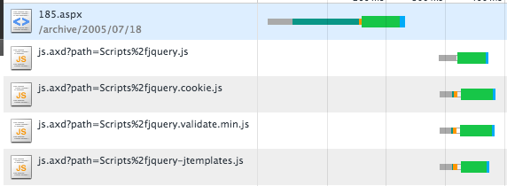

.. network_http:

*************************
HTTP
*************************

WWW에서 전자문서 주고 받기 위해 고안된 프로토콜이다.

==========================
 지속 연결 vs 비지속 연결
==========================

**비지속 연결은 매번 자원을 요청할때 새로운 TCP Connection을 생성하는 것을 뜻한다. 예를들어 페이지가 기본 HTML파일과 10개의 JPEG 이미지로 구성된다고 가정하자.** 

URL : **http://www.someSchool.edu/someDespartment/home.index**

연결 수행 과정은 다음과 같다.

1) someSchool 호스트의 80포트로 TCP 연결을 요청한다. 이때 TCP 핸드셰이킹이 발생하고 연결이 성공한다.
2) 80포트의 /someDespartment/home.index 라는 Path로 HTTP GET 요청 메세지를 작성한 뒤 1)에서 연결된 TCP 소켓을 통해 전송한다.
3) someSchool.edu 서버는 소켓으로 전달된 HTTP 요청 메세지를 분석한다. 그리고 Path에 있는 리소스를 찾은 뒤 압축하여 HTTP 응답 메세지를 클라이언트에게 전송한다.
4) 클라이언트는 HTTP 응답 메세지를 완벽하게 전달 받으면 연결을 종료한다. 압축된 메세지를 해제한 뒤 HTML에서 이미지를 찾는다.
5) 이미지를 1~4의 방법으로 다시 요청한다.

위의 방식대로 브라우저가 요청-응답 쌍을 다른 TCP Connection에서 수행한 것 이다. 비지속연결은 11번의 연결이 이뤄지게 된다. 이때 10번의 이미지 요청은 동시에 소켓을 열어서 요청할 수 있다. 이를 동시 요청이라고 하며 응답시간을 줄일 수 있다. 

RTT란 HTTP요청을 하고 응답을 수신할때 까지 걸리는 시간이다. 이때 RTT는 전송 지연, 전파 지연, 패킷 큐잉 지연, 패킷 처리 지연을 포함한 시간이다. 위의 경우 2RTT + 응답파일 전송 시간(TCP 3-핸드셰이킹 + HTTP요청 응답 + 응답 파일 전송 시간) 이다.

**지속 연결은 하나의 TCP Connection을 생성하고 그 연결을 통해 모든 요청을 처리하는 것이다.** 기본적으로 하나의 Connection을 통해 여러개의 요청을 파이프라이닝 기법을 활용하여 전송하게 된다. 

지속 연결 헤더::

	Connection: Keep-Alive

**HTTP 1.0 기준으로 클라이언트에서 지속연결을 원할 때 Keep-Alive를 헤더에 담아서 요청을 보낸다.** 서버는 요청을 받고 역시 헤더에 담아서 응답한다. 이 TCP 커넥션을 통해 다른 요청을 보낼 수 있다. 서버나 클라이언트 측에서 더이상 연결이 필요없다고 판단할 경우 연결을 종료한다.

**HTTP 1.1 기준으로 달리 명시되 있지 않으면 모든 연결은 지속연결로 간주된다.** 하지만 각 서버마다 타임아웃(TIEMOUT)이 존재한다.

비지속 연결을 하고 싶다면 다음처럼 명시한다.::

	Connection: close

서버가 지속 연결을 멈추고 싶을때도 사용해라::

	Connection: close

**지속 연결은 서버 가용성에 문제를 일으킬 수 있으나 RTT(Round trip time)을 감소 시키고 소켓 수를 감소 시킨다.** 

**주항색 선** 은 새로운 TCP 연결이 발생했다는 것을 의미한다.

2번째 요청에서 서버는 **Connection: close** 를 발생시켰다. 그래서 3번째 요청에 다시 3-핸드셰이킹을 한 것을 볼 수 있다.

=============
 컨텐츠 압축
=============

압축은 HTTP 요청의 **Accept-Encoding: gzip, deflate, sdch** 과 **HTTP 응답의 Content-Encoding: deflate** 이 관련이 있다.

먼저 클라이언트가 처리할 수 있는 압축 알고리즘을 Accept-Encoding에 명시한다. 서버는 컨텐츠를 압축한 뒤 Content-Encoding에 명시해서 함께 보낸다. 따라서 컨텐츠 압축을 해제해야만 원래 콘텐츠를 확인할 수 있다.

=============
 컨텐츠 타입
=============

-------------------------
multipart/form-data
-------------------------

*multipart/form-data는* 경계(boundary)로 구분된 연속된 데이터를 나타내는 형식을 뜻한다. 주로 POST 메서드일때 사용된다.

경계(boundary)는 HTTP 헤더 뒤에 **"--"와 "경계값"으로** 이루어진 시퀀스이며 구분자이다.

경계는 *Content-Type 헤더* 의 *boundary* 매개변수에 포함된다.::

  Content-Type: multipart/form-data; boundary=-------------------12345678912345\r\n

경계(boundary)는 바디의 시작(~~\r\n), 파트 사이(\r\n~~\r\n), 마지막(\r\n~~\r\n에 위치한다. 또한 경계값은 각 파트의 데이터에 포함되지 않는 값으로 구성되어야 한다.

파트(Part)
==========

각 파트는 *Content-Disposition 헤더* 를 포함해야 하며 반드시 name 매개변수를 포함해야한다.::

  Content-Disposition: form-data; name="age"

전송하려는 데이터가 파일이라면 파일의 이름도 포함해야 하며 filename 매개변수를 포함해야한다. 일반적으로 filename 매개변수의 값은 UTF-8로 인코딩되어 전달된다::

  Content-Disposition: form-data; name="age"; filename="hello.jpeg" 

**수신 서버나 에이전트는 filename의 유효성이나 중복을 확인하지 않고 맹목적으로 사용해서는 안된다.**

또한 각 파트는 *Content-Type 헤더* 를 포함할 수 있다.(text/plain, application/octet-stream, 등등)::

  Content-Type: application/pdf

---------------------------------
application/x-www-form-urlencoded
---------------------------------

*application/x-www-form-urlencoded는* 여러개의 key,value 쌍을 전송할때 사용된다. 알파벳이 아닌 문자는 퍼센트 인코딩되어 전송되며 POST 메서드일때 사용된다.

===========
 Stateless
===========

**HTTP 프로토콜은 상태를 유지하지 않는다.** 반면 SSH 프로토콜은 서버에서 클라이언트 상태를 유지한 상태로 데이터를 주고받는다. 이를 위해 서버에서는 세션값을 이용해 클라이언트 상태를 유지한다. **세션은 세션메모리에 저장되며 이를 찾는 검색값을 세션 아이디라고 한다.** 

======
 쿠키
======

서버가 사용자한테 전송하는 작은 데이터이며 주로 HTTP에서 상태를 저장할때 사용한다. 쿠키는 영속적인 쿠키, 세션 쿠키로 나눠진다. 영속적인 쿠키는 디스크에 저장되며 세션 쿠키는 메모리에 저장된다. 쿠키는 브라우저의 네트워크 탭이나 document.cookie로 확인할 수 있다. 

최근에는 주로 세션 관리(로그인, 로그아웃) 목적으로 활용된다. 이와는 별개로 개인화, 행동 분석을 위해 활용하기도 했으나, localStorage API로 대체되고 있다.

----------------------
set-cookie 헤더
----------------------

set-cookie는 클라이언트에 쿠키를 전달할때 사용하는 헤더이다. set-cookie로 쿠키 전송시 여러가지 속성을 줄 수 있다.

*HttpOnly* 속성을 부여할 경우 쿠키를 document.cookie API로 확인할 수 없다. 이는 XSS 방지를 위한 것이다. *Secure* 속성은 SSL위에서만 쿠키를 전송하도록 강제할 수 있다. *Domain* 속성은 쿠키가 전송될 도메인을 설정할 때 사용한다. Domain 속성이 없을 경우 현재 페이지의 호스트를 기본값으로 사용한다. *Path* 속성은 쿠키가 전송될 경로를 설정할 때 사용한다.::

  Set-Cookie: id=aaaa; Expires=Wed, 1 Feb 2018 01:11:00 GMT; Secure; HttpOnly; Domain=example.com; path=/

========
 인코딩
========

-------------------------------
퍼센트 인코딩(Percent-Encoding)
-------------------------------

아스키가 아닌 문자와 스페이스, 제어문자등을 인코딩하는 방법을 나타낸 표준이다. 각각의 바이트는 **%ff** 처럼 %와 16진수 시퀀스로 인코딩된다. 예를들어 **"안녕" 이라는 문자열은 %EC%95%88%EB%85%95** 와 같이 인코딩된다. RFC3986에 정의되어 있다.

======
 참조
======

- HTTP 스펙: https://tools.ietf.org/html/rfc2616
- Multipart/form-data: https://tools.ietf.org/html/rfc7578
- Cookie: https://developer.mozilla.org/ko/docs/Web/HTTP/Cookies