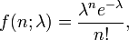

.. _statistics_terms:

****************
기초확률통계학
****************

통계학 용어 정리
==============================

.. _basic_statistics_terms:

- 확률 : 불확실성을 나타내는 수학적 언어로 사건의 발생 가능성을 0과 1사이의 수로 표현
- 실험 : 의사결정을 위해 자료를 수집하는것
- 표본점 : 집합이론 관점에서 표본공간의 원소이다. 개별 실험결과
- 표본공간(Sample space) : 실험에 의해 나온 모든 결과의 모음
- 사건 : 집합이론 관점에서 표본공간의 부분집합이다. 하나 둘 이상의 실험결과
- 사건 A의 확률 : P(A)
- 집합의 표현 방법
- 확률 변수 : 실험의 결과를 숫자에 대응 시킨 것

..

	1) 원소 나열법 : {...}
	2) 조건 제시법 : S={x|0<x<10}

.. _basic_statistics_distribution:

분포
==========

확률함수는 다양한 분포를 따르고 있다.

이산형 분포
------------------

다음과 같은 이산형 분포가 있다.

- 베르누이 분포 : 성공과 실패가 나오는 실험을 하였을때 성공에 대한 확률 분포
- 이항 분포 : n번 베르누이 시행을 하였을때 성공에 대한 확률 분포
- 기하 분포 : 1번의 성공이 나올때 까지 시행한 횟수에 대한 확률 분포
- 음이항 분포 : n번의 성공이 나올때 까지 시행한 횟수에 대한 확률 분포
- 포아송 분포 : 고정된 시간 또는 공간에서 사건이 발생하는 횟수가 일정할때 사건 발생에 대한 확률 분포

*이항 분포* 의 확률 함수 f(x)는 다음과 같다. (X ~ B(시행횟수, 확률))

손쉬운 확률 계산을 위해 이항 누적분포 확률표를 제공한다.

이항분포에서 시행 횟수가 크고 평균 (n\*p)이 일정하다면 확률 계산을 위해 이항 분포대신 포아송 분포를 사용할 수 있다. 보통 근사할 수 있는 시행횟수은 25보다 크거나 30보다 클때를 뜻한다.

*포아송 분포* 의 확률 함수 f(x)는 다음과 같다. (X ~ P(평균횟수)) `포아송 분포(위키) <http://ko.wikipedia.org/wiki/%ED%91%B8%EC%95%84%EC%86%A1_%EB%B6%84%ED%8F%AC>`_

이때 *람다* 표기는 단위시간당 사건 평균 발생률을 의미한다. 또한 *x* 는 사건의 발생 횟수에 관한 확률 변수이다. 포아송 분포는 사건이 발생하기 어려울때를 나타내는 확률분포이다. 손쉬운 확률 계산을 위해 포아송 누적 분포 확률표가 존재한다.

여러가지 특징이 있지만 필자가 생각하는 중요한 특징은 특정 구간에서의 사건발생확률은 그 구간의 길이에 비례한다는 성질이다. 

*음이항 분포* 의 확률 함수 f(x)는 다음과 같다. (X ~ NB(성공횟수, 확률))

음이항 분포는 k번의 성공을 할때까지 시행한 횟수에 관한 확률 분포이다. 기하 분포는 성공횟수가 1일때의 음이항 분포와 같다.

연속형 분포
------------------

균등 분포 : 특정 구간에 확률 변수 X가 놓일 확률이 구간의 길이에 비례하는 실험의 분포이다. (X ~ U[a,b])

지수 분포 : 사건이 발생하기까지 걸리는 대시간에 대한 확률 분포이다.

아래 함수는 지수 분포의 확률밀도 함수이다.

아래 함수는 지수 분포의 누적분포 함수이다.

누적 분포함수는 x시간 이내에 사건이 발생할 누적확률을 나타낸다. 따라서 *1-누적분포함수* 는 x시간 까지 사건이 발생하지 않는 확률함수로서 *신뢰도 함수* , *잔존률 함수* , *생존률 함수* 라는 이름으로 불린다.

지수함수는 음이항분포와 마찬가지로 무기억성을 가지고있다. 마지막으로 필자가 지수분포를 공부했을때는 확률밀도 함수보다 누적분포 함수나 잔존률 함수가 더 유용하게 쓰였다.

통계량
==========

통계량이란 모집단에서 추출한 표본의 특성을 나타내는 값으로 *표본평균* , *표본분산* , *표본비율* 등이 있다. 표본평균의 특징은 모평균이 u, 모분산이 v^2인 모집단에서 n개의 표본을 복원추출했을때 표본평균의 평균이 u이고, 분산이 v^2/n 인 하나의 분포를 이루게 된다는 점이다. 

표본평균이라는 확률변수를 도출하는 과정은 다음과 같다. 먼저 모집단에서 n개의 표본(2개, 3개, ...n개 등 표본의 크기는 다양하게 정할 수 있음)을 복원추출한다면 각 표본은 결국 원래 모집단의 확률 분포를 따르는 하나의 확률 변수가 될 것이다. 추출한 확률변수를 더한 후 표본의 개수로 나누면 표본평균이 산출된다.

예를들어 3개의 표본을 복원추출 하였다면 표본평균은 (X1 + X2 + X3) / 3 라는 확률변수를 가지게 되고 평균은 *모평균* , 분산은 *모분산/n* 을 따르는 확률분포를 따른다.

이외에도 표본분산, 표본비율 역시 하나의 확률변수로서 특정한 확률분포를 따른다. 

표본 비율은 Y ~ B(표본의 크기, 확률) 일 때 Y/n 이라는 확률 변수를 가진다.

표본분산은 조금 특이하다. (표본분산^2 * (표본의 크기 - 1) / 모분산^2) 이라는 확률 변수는 ~ X(표본의크기 - 1)을 따른다. 이때 X는 자유도 n-1을 가지는 카이제곱 분포이다. 카이제곱 분포는 모집단이 정규분포를 따를때 사용할 수 있다.

t분포
----------

*모집단이 정규 분포* 를 따르고 표본평균의 분포를 확인하는 과정에서 분포는 정규분포 분산은 모분산/n을 사용하였다. 하지만 모분산을 알 수 없을 경우 모분산 대신 표본분산을 사용할 수 있다. 표본분산은 S^2으로 나타내고 모분산 대신 사용된다. 이 경우 표본평균은 표준정규화분포 대신 자유도 n-1인 T분포를 따르게 된다.

자유도가 n-1이 되는 이유는 모분산 대신 표본분산을 사용하면서 자유도를 1만큼 상실하였기 때문이다.

